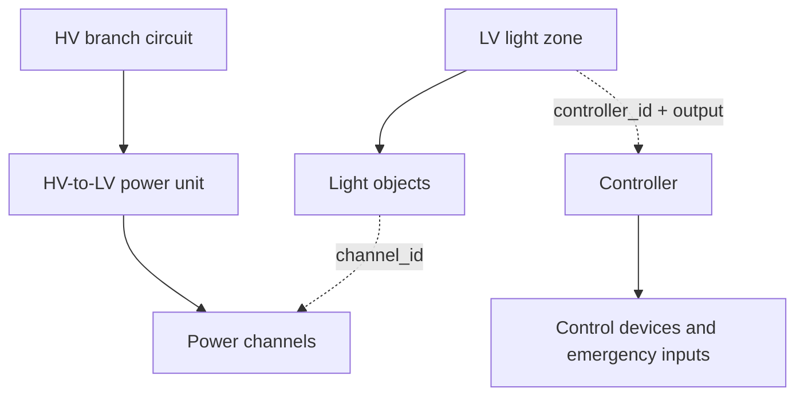

# Lighting Device Hierarchy v0.2

This draft implements the owner-provided device hierarchy. It supersedes the v0.1 assumption that each power channel has one control zone. The existing v0.1 schema, validator, and CSV exporter remain available for the original narrow baseline; they do not consume this v0.2 structure.

## Ownership and Cross-References

Use one authoritative object for each physical item. Nest devices where ownership is stable. Reference other owners with short stable IDs. The logical contract works in JSON or XML; the current executable draft uses JSON, consistent with the repository foundation.

| Owner | Nested objects | Cross-references |
|---|---|---|
| Project | Branch circuits, LV light zones, controllers, source register, device/type registers | Shared reference IDs |
| HV branch circuit | HV-to-LV power units | Optional backup supply |
| HV-to-LV power unit | Power channel objects | Connected controls, backup supply |
| LV light zone | Light objects | Controller/output, shared control groups, emergency input |
| Controller | Emergency input definitions | Connected control devices, optional integrated power unit, control power backup |
| Light object | Preserved source observations and selected LV design | Fixture type, power channel, optional fixture-level backup supply |

Zones and channels are many-to-many through individual light objects. Each single-input light belongs to one zone and references one power channel. This reveals exactly how much of each zone's load is on each channel. Do not place a whole zone's wattage on every channel it touches.

## Object Contract

| Object | Recorded information | Derived information |
|---|---|---|
| HV branch circuit | Panel/circuit identity, operating voltage/phases, breaker rating when known, power units, backup provision | Lighting input load contributed by its units |
| Power unit | Operating input voltage/phases; output power class; rated input/output watts; confirmed design input watts; aggregate output design budget; hardware channel count; channels; connected control interfaces | Connected output watts, served zones/light IDs, explicit physical unit quantity |
| Power channel | Rated output, selected design limit/profile, class, AC/DC and nominal/range voltage, auxiliary load, confirmed compatibility | Connected watts, light IDs, LV zone list, remaining margin |
| LV light zone | Light list, controller/output, dimming capability, control types, on/off strategy, normal behavior, egress role, emergency response/input, schedule-group references | Zone total watts and connected power-channel list |
| Light | Stable identity, original fixture type/branch/zone observations, page/anchor/optional annotation ID; selected LV description/load/compatibility/channel | Individual connected watts |
| Controller | Hardware identity, verified independent output capacity, control devices, emergency inputs, optional integrated-unit identity and control power backup | Connected light zones and occupied outputs |

`number_of_channels` is equipment capacity; the number of channel objects can be smaller when spare outputs are not individually modeled. A typical four-output controller is a project convention, not a universal schema limit. Power channel numbering and controller-output numbering are independent.

## Load Basis and Input/Output Distinction

Each source type and selected light records a load basis: `per_fixture`, `per_foot`, or `per_reference_length`. Retain the rate and actual length where needed. Examples: 18 ft at 4 W/ft = 72 W; an 8 ft run specified at 23 W per 4 ft = 46 W. These are arithmetic examples, not product facts.

Preserve source fixture watts separately from confirmed LV load at the power-channel interface. Source schedules can list several acceptable products with different watts. The selected LV load remains unknown until that choice and conversion are confirmed.

Channel watts = assigned light watts + confirmed channel auxiliary load. Zone watts count its lights once. Unit connected output watts sum its channels once. Branch lighting input watts sum the units' confirmed input-load basis. Never assume AC input watts equal LED/output watts or infer efficiency from unrelated nameplate maxima. Input-current/PF, branch sizing, diversity, battery charging, and inrush checks are beyond this draft's implemented arithmetic.

## Power Classes and Voltage Profiles

Store power class and voltage separately. Record both fixed and ranged outputs and distinguish AC/DC. Do not hardcode 0-56 V as a universal ceiling or apply a 90 W limit to all classes.

The `class2_100w_90w_design` profile retains KIS's nominal 100 W / <=90 W design doctrine. `product_specific` accepts explicitly selected ratings for other equipment. The latter only checks stated load/capacity consistency; no Class 1, 3, or 4 compliance engine is implemented.

Class 4 transmitter/receiver stages and conversions require an explicit later topology extension. A numeric 400 V value does not establish that a direct connection to an LED luminaire is appropriate. Listing, code edition, location, and installation constraints remain separately verified product/project facts.

Source references for this modeling decision: [UL 1310 scope](https://www.shopulstandards.com/ProductDetail.aspx?UniqueKey=42891) describes a Class 2 power-unit voltage envelope including 60 V continuous DC; [UL Class 4 certification background](https://www.ul.com/news/ul-solutions-issues-first-certification-fault-managed-power-system-panduit) identifies listed fault-managed systems and NEC Article 726. These references justify separate class-specific validation, not automatic project approval.

## Controls and Emergency Operation

`control_types` is a list because occupancy and timeswitch control may coexist. `on_off_type` records vacancy/occupancy/partial-on behavior; dimming capability is separate. A controller's independent output is the authority for the zone's operation. Sharing a power channel does not prove that independently controlled zones can share a controller output.

Preserve the owner's labels with explicit operating-state meaning:

| Egress type | Normal operation | Emergency operation |
|---|---|---|
| `normal` | Recorded normal zone behavior | No assigned emergency force-on requirement |
| `em_always_off` | Standby/off while normal power is available | Force on when normal power is lost |
| `em_always_on` | Always on while normal power is available | Maintain/force on during outage |
| `em_normally_controlled` | Normal switching/dimming remains active | Override to on during outage |

The third emergency variant preserves normally controlled interior fixtures used for emergency illumination. Source emergency battery/driver notation remains a source fact; the selected central/fixture backup and control architecture are engineering decisions.

Emergency zones reference an input on their assigned controller. That input records the normal-power-loss source, monitored branch circuit, interface/signal type, trigger condition, and confirmation state. Group emergency strings so the intended controller output can execute the override without forcing unrelated normal fixtures to follow it. Required signal routing and termination are deliverable inputs, not inferred from a color or a fixture suffix.

Backup supply is independent of the command. Record central UPS/battery or fixture-level supply provisions and ensure the controller can remain operational during the outage. The draft checks declared provision/reference/verification consistency. It does not certify runtime, illumination, emergency listings, failure response, transfer architecture, or all signaling paths.

## Identity and Source Traceability

Assign stable internal light IDs from the first reviewed takeoff. IDs survive regrouping, channel reassignment, and visible-label changes. Page, fixture type mark, coordinates, and source annotations are evidence, not the entire identity. Store and reconcile the mapping on each source revision rather than renumbering by spatial sort.

When editable PDF annotations carry persistent annotation IDs, preserve them as source anchors. A circle marking a homerun is a channel/route candidate; it is not a fixture ID. Geometry and nearby labels help identify lights but must be reviewed before confirming occurrences. Visible fixture labels can be generated later; internal IDs already support reliable counts and verification.

MEP ZONE 1-4 are source design intent and constraints, not our LV light zones. `control_groups` preserves those source requirements and references; it does not define our device/control hierarchy. Local LV zones reference the applicable source intent while retaining their own IDs, room/micro-control boundaries, and controller-output assignments. Several LV zones may satisfy one MEP source zone. Do not automatically create LV zones or assign channels/controllers from the source zone numbering.

Review the proposed LV operation against each applicable source requirement. Record conflicts or proposed deviations as engineering decisions and open items/RFIs; preserve the source requirement unchanged. The current checker verifies these references, but source-intent compliance remains a human review step. A source circuit label on a fixture likewise remains separate from the selected PDU input branch.

## Draft Boundaries and Stewardship

The draft schema supports a single power input per light object and one primary controller/output per LV zone. Split feeds, multi-segment fixtures, multiple primary controllers, standby/dual inputs, Class 4 receivers, and non-LV exclusions need explicit extensions rather than duplicate light objects or silently dropped source fixtures.

Checkpoint source reconciliation remains a human review requirement. The v0.2 draft does not yet provide a complete source-occurrence exclusion register or the v0.1 CSV exports. Its CLI produces derived cross-reference/load views and issue lists. Project evidence and real models remain outside Git. Owner: KIS Solutions; October 2026; draft pending design review.
