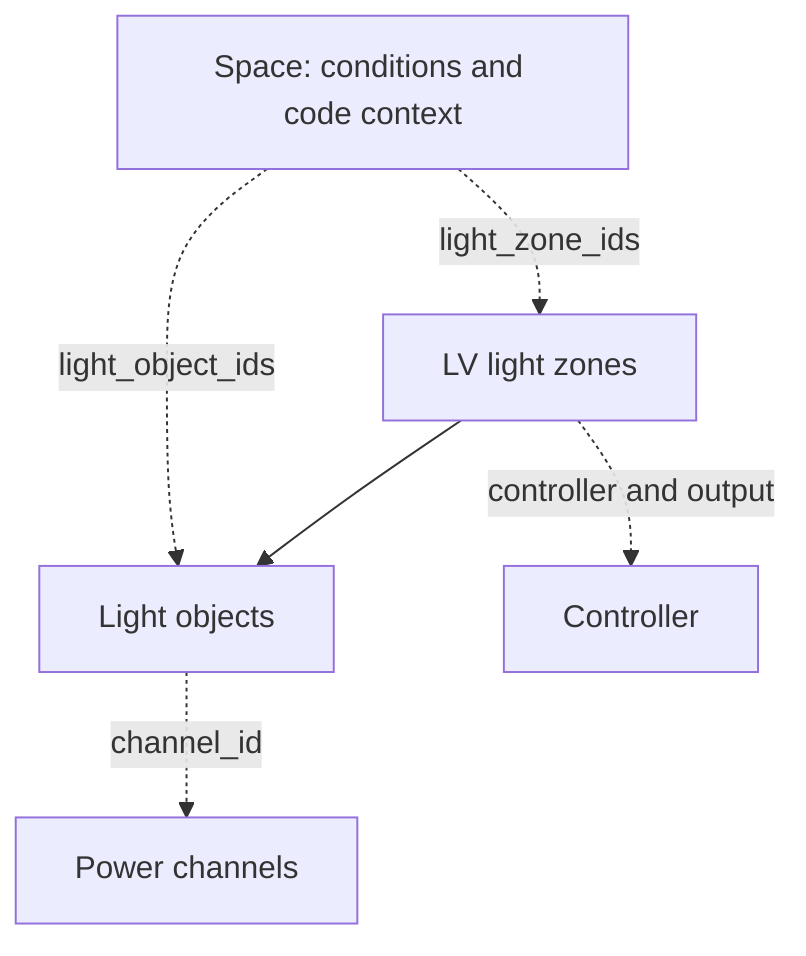

# Space Context and Fixture Identity v0.3

This is the preserved v0.3 contract. New physical-first projects use [v0.4](physical-intake-v0.4.md), where lights exist without zones, phase checks separate intake/design, and current review CSVs are available. Do not follow legacy nested ownership as a reason to invent placeholder zones.

Draft revision 0.3.1 adds optional served-level, inventory-only, and fixture mounting context plus reviewed shared-zone membership. Existing 0.3.0 models remain supported by the v0.3 schema/checker.

This additive draft extends the [v0.2 device hierarchy](device-hierarchy-v0.2.md). New projects can use `lighting-project-v0.3.schema.json` and `python -m generators.model_spaces MODEL`. Existing v0.2 data and its checker remain supported. No automatic conversion invents rooms, code classifications, areas, or daylight conclusions.

## Ownership and References

Space references existing lights and zones; it owns neither a second copy of lights nor their channels. Each light appears once in a zone and is referenced by one primary served Space. Several channels can serve one Space, and a channel can supply multiple Spaces when the verified downstream architecture permits it. Reference-list consistency is checked before count views are emitted.

## Architectural Intake, Levels, and Mounting

Start with the [Architectural Floor Plan or Dimension Plan](../../design-playbooks/architectural-space-intake.md). Compare RCP/electrical labels and record mismatches in `open_items[]` and the review discrepancy list. Preserve architectural identities separately from derived descriptions and classifications. Consequential boundary details belong in narrative descriptions with evidence; uncertain partial-wall/open boundaries need discussion before finalization.

Optional `Space.level` identifies the occupied/served floor, not the level of the fixture's drawing or ceiling. A multi-level stair can use null and a description of its extent, or separate level records with the same named lighting zone. Preserve specified MEP operation; use one zone per physical stair only when documented behavior and reviewed independent-control constraints support shared operation. An untagged open-to-below portion of a reception remains in reception when it has no distinct use/designation. Assign its overhead fixtures to reception's occupied level and preserve the upper-level fixture source.

Optional `LightObject.mounting` records `height_above_served_floor_ft`, `height_basis`, `note`, and `source_ref_ids`. A qualitative “high-mounted; verify height” observation leaves numeric height null. Known estimates require an explicit basis/note. This draft clarification is additive: existing v0.3 models without these optional fields remain supported, and the v0.2 checker receives a projection without the v0.3 mounting extension.

Optional `inventory_only: true` records an unlit service void/chase with observed location and supported purpose in `description`, empty light/zone lists, and source evidence. Leave untagged purpose unknown unless source-supported or owner-confirmed, under the intake workflow's no-assumptions verification rule. This entry is accounted for without forcing a fictitious lighting design or energy classification. Adding lights or zones requires removing inventory-only status and completing the lighting review.

## Workflow and Review Readiness

The [current LV workflow](../../design-playbooks/lv-project-workflow-and-readiness.md) extracts the specified MEP scheme and checks it through WikiJS. It does not infer a new control scheme from room classification. Room-intake readiness is a separate review milestone from final electrical/code readiness; the current checker does not implement separate milestone gates. Unknown later-stage values must remain unknown rather than being filled to force a checker pass. The agreed zone review statuses and source/applied/proposed sequence separation await a versioned extension.

## Four Distinct Classifications

Preserve the plan name and `source_room_type`. Record `building_code_space_type`, `building_code_occupancy_group`, and `energy_code_space_type` independently. Do not silently translate one into another. An inferred energy classification needs an explanation and confirmed decision; unknown building classifications remain null.

The project's selected code basis is separate from a Space's applicable/reference provisions. Store edition, jurisdiction, amendments review, and evidence. Adding a provision to a room does not establish local adoption or prove compliance.

## Area and Daylight Conditions

Prefer explicitly labeled architectural room square footage as the initial `area_sq_ft`, with `area_basis: source_document`, source references, and a high-confidence extraction note in `area_note` when the value, units, and room association are clear. Preserve any stated area convention without inferring one. Flag ambiguous or conflicting labels; retain later boundary measurements as separate evidence for reconciliation rather than silently replacing the source area. Follow [architectural room-area intake](../../design-playbooks/architectural-space-intake.md#architectural-room-areas).

For markup-derived areas, use the architectural floor/dimension plan when available, otherwise the applicable RCP. The architectural scale printed with the plan view is the preferred conversion source; retain its locator and verify its applicability to the PDF. Accepted takeoffs use `area_basis: measured`, with view/scale/boundary-review evidence retained. Follow [boundary markups and drawing scale](../../design-playbooks/architectural-space-intake.md#boundary-markups-and-drawing-scale). This is source-review guidance; the current schema/generators do not implement boundary geometry or scale-based area calculation.

Keep estimated area and its basis. Independently controlled subzones record `control_area_sq_ft` and `control_area_basis`. These fields support size-sensitive review; this draft does not implement a complete code engine or infer sensor coverage from area.

For the IECC 2021 reference profile, C405.2.1 explicitly lists enclosed offices (item 5). The 300 ft2 catch-all is not a universal enclosed-office exemption. C405.2.1.3 distinguishes open offices below 300 ft2 and requires separately controlled areas no greater than 600 ft2 in the other open-office cases. Verify the adopted edition and amendments before applying these conditions. Source: [ICC IECC 2021 Chapter 4](https://codes.iccsafe.org/content/IECC2021V3.0/chapter-4-ce-commercial-energy-efficiency).

Record window presence, geometric daylight-zone presence, and required daylight controls separately. A no-controls decision retains its actual assessment and applicable exemption/load/geometry basis; unknown geometry remains null. Do not evaluate room daylight-control applicability by looking at each supply channel's watts separately.

## Explicit Zones, Optional Drawing Labels

Every functional zone receives a stable internal ID. `label_mode: room_default` permits `label: null` when the whole room is one zone. The derived display label uses the room name. Such a zone must cover the room's modeled lights and one Space; its control area can be derived from that Space.

`label_mode: named` requires a visible label, which may be `$z109`. The internal ID remains a schema-safe value such as `ZONE-109`; display labels may change without renumbering references. Named zones record control area and basis for code review. Cross-room zones require explicit naming and review of whether common operation is permissible. Space zone lists must include the zones owning their lights. An additional named zone serving a Space without a directly assigned light requires a description and confirmed membership decision, allowing an upper-level stair light to serve another level without duplicating its physical record.

## Derived Room Views and Limits

The checker emits room fixture counts by type, connected light watts, channel IDs, light-to-Space and zone-to-Space membership, zone display names, and control areas. Counts do not replace the individual assignments needed to partition loads or handle emergency differences.

The draft retains a single power input per light and one primary controller/output per zone. Full source exclusions, daylight polygons, sensor coverage, calibrated area measurement, compliance certification, bulk-count-to-occurrence reconciliation, and v0.3 CSV/PDF presentation are not implemented. Data consistency is not code approval.
